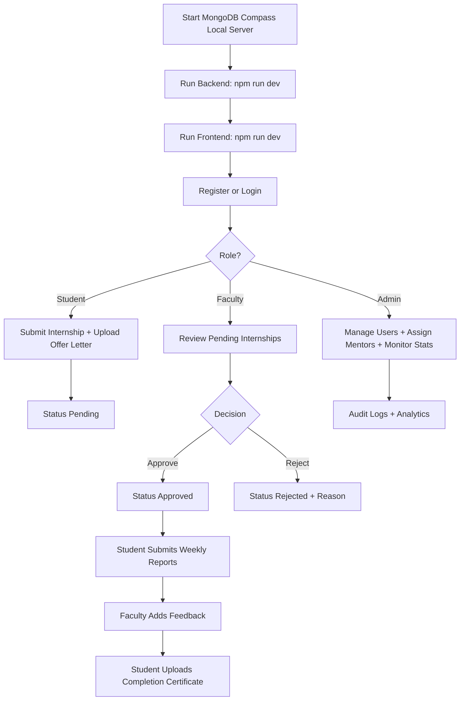

# Student Internship Tracking System (SITS)

A complete, production-style MERN application for tracking student internships with role-based access, document uploads, report review workflows, analytics dashboards, dark/light theming, and audit logging.

## Overview

SITS is designed for academic institutions to manage internship workflows from submission to approval and reporting.

Core capabilities:

- JWT-based authentication with secure password hashing
- Role-based access control (Student, Faculty, Admin)
- Internship lifecycle management (`Pending -> Approved -> Rejected`)
- Local file uploads via Multer (`/backend/uploads`)
- Weekly report submission and mentor feedback
- Admin analytics, user management, mentor assignment
- Dashboard charts (Recharts)
- Basic notification panel for status updates
- Dark/light mode with persisted preference
- Integration tests with role-based API assertions
- Audit trail logging for critical actions

---

## Tech Stack

### Frontend

- React (Vite)
- Tailwind CSS
- React Router
- Axios
- Recharts
- Framer Motion
- Context API

### Backend

- Node.js + Express
- MongoDB + Mongoose
- JWT + bcryptjs
- Multer (local disk storage)
- express-validator

### Testing

- Jest
- Supertest
- mongodb-memory-server

---

## Project Structure

```text
InternShip/
  backend/
    app.js
    server.js
    package.json
    config/
      db.js
    models/
      User.js
      StudentProfile.js
      Internship.js
      Report.js
      Feedback.js
      AuditLog.js
    controllers/
      authController.js
      internshipController.js
      reportController.js
      adminController.js
      profileController.js
    routes/
      authRoutes.js
      internshipRoutes.js
      reportRoutes.js
      adminRoutes.js
      userRoutes.js
      facultyRoutes.js
      profileRoutes.js
    middleware/
      authMiddleware.js
      errorMiddleware.js
      uploadMiddleware.js
      validateObjectId.js
      requestValidation.js
    utils/
      generateToken.js
      validators.js
      audit.js
    tests/
      setup.js
      integration/
        rbac.integration.test.js
    uploads/

  frontend/
    package.json
    postcss.config.cjs
    tailwind.config.cjs
    src/
      App.jsx
      main.jsx
      index.css
      context/
        AuthContext.jsx
        ThemeContext.jsx
        NotificationContext.jsx
      services/
        api.js
      routes/
        AppRoutes.jsx
        ProtectedRoute.jsx
      layouts/
        AppLayout.jsx
      components/
        common/
          AnimatedPage.jsx
          NotificationsPanel.jsx
        dashboard/
          AnalyticsCharts.jsx
        layout/
          Navbar.jsx
          Sidebar.jsx
      pages/
        Login.jsx
        Register.jsx
        StudentDashboard.jsx
        FacultyDashboard.jsx
        AdminDashboard.jsx
        AddInternship.jsx
        ReportsPage.jsx
        ProfilePage.jsx
        Unauthorized.jsx
        NotFound.jsx
```

---

## User Roles and Permissions

### Student

Can:

- Register/login
- Create internship with offer letter upload
- View own internships
- Upload completion certificate
- Submit weekly reports with attachment
- View own report history and feedback
- Manage own profile and resume

Cannot:

- Access admin routes
- Approve/reject internships
- View other students' data

### Faculty

Can:

- Login and access faculty dashboard
- View internship submissions
- Approve/reject internships
- View student reports
- Provide report feedback

Cannot:

- Perform admin user CRUD
- Delete users

### Admin

Can:

- Manage users (create, list, update, delete)
- Assign mentors
- View system stats/analytics
- Access all management routes

Cannot:

- Delete own account (safety guard)

---

## Workflow

1. Student registers/logs in.
2. Student submits internship + offer letter.
3. Internship status starts as `Pending`.
4. Faculty/Admin approves or rejects.
5. Student submits weekly reports.
6. Faculty/Admin reviews and adds feedback.
7. Student uploads completion certificate.
8. Admin monitors users and overall statistics.

---

## Working Flow (Easy Guide)

This section explains how the system works in one continuous flow so new developers, reviewers, and users can quickly understand the project.

### A) First Run Flow (Developer)

1. Start backend server.
2. Start frontend app.
3. Open the frontend URL in browser.
4. Register as Student, Faculty, and Admin (or use seeded demo users).
5. Login with each role to verify role-based dashboard access.

### B) Authentication Flow

1. User opens Login or Register page.
2. Backend validates credentials and returns JWT token.
3. Frontend stores token in localStorage and attaches it automatically to future API requests.
4. User is redirected to role home page:
  - Student -> Student Dashboard
  - Faculty -> Faculty Dashboard
  - Admin -> Admin Dashboard
5. If token expires or becomes invalid, user is logged out and asked to login again.

### C) Student Journey Flow

1. Student adds internship details with offer letter upload.
2. Internship is created with default status Pending.
3. Student tracks internship status in dashboard table.
4. Student submits weekly reports with optional attachments.
5. Student receives mentor feedback updates on reports.
6. Student uploads completion certificate at the end of internship.
7. Student keeps profile and resume updated.

### D) Faculty Journey Flow

1. Faculty opens Review Center.
2. Faculty views pending internships.
3. Faculty approves or rejects each internship.
4. Faculty opens student report history for an internship.
5. Faculty writes feedback and marks reports reviewed.

### E) Admin Journey Flow

1. Admin views platform statistics and charts.
2. Admin creates, updates, and deletes users.
3. Admin assigns mentors to students.
4. Admin monitors overall internship lifecycle and user activity.

### F) System Data Flow Summary

1. Frontend submits form data (JSON or multipart for files).
2. Backend validates request and role permissions.
3. Mongoose models persist records in MongoDB.
4. Uploaded files are stored in backend/uploads.
5. Backend returns normalized response objects.
6. Frontend updates UI state, shows notifications/toasts, and refreshes role views.

### G) Quick End-to-End Demo Scenario

1. Login as student and submit internship.
2. Login as faculty and approve internship.
3. Login as student and submit week-1 report.
4. Login as faculty and add feedback.
5. Login as student and verify feedback appears.
6. Login as student and upload certificate.
7. Login as admin and verify stats/users are visible.

---

## API Reference

Base URL: `http://localhost:5000/api`

### Auth

- `POST /auth/register`
- `POST /auth/login`

### Internship

- `POST /internships` (student)
- `GET /internships` (authenticated)
- `GET /internships/my` (student)
- `GET /internships/all` (faculty/admin)
- `PUT /internships/:id/status` (faculty/admin)
- `PUT /internships/:id/approve` (faculty/admin)
- `PUT /internships/:id/reject` (faculty/admin)
- `PUT /internships/:id/certificate` (student)

### Reports

- `POST /reports` (student)
- `GET /reports/:internshipId` (role/ownership restricted)
- `PUT /reports/:reportId/feedback` (faculty/admin)

### Faculty

- `GET /students` (faculty/admin)

### Admin

- `GET /admin/users`
- `POST /admin/users`
- `PUT /admin/users/:id`
- `DELETE /admin/users/:id`
- `PUT /admin/assign-mentor/:studentId`
- `GET /admin/stats`

### User Management Alias (Admin)

- `GET /users`
- `POST /users`
- `DELETE /users/:id`

### Profile

- `GET /profile` (student)
- `PUT /profile` (student, resume upload)

---

## API Examples

Base URL used in examples:

`http://localhost:5000/api`

### 1) Register User

Request:

```http
POST /api/auth/register
Content-Type: application/json

{
  "name": "Aarav Student",
  "email": "aarav.student@test.local",
  "password": "Pass@1234",
  "role": "student"
}
```

Response (201):

```json
{
  "_id": "67f0b0d8d6d9a4f0d2f09111",
  "name": "Aarav Student",
  "email": "aarav.student@test.local",
  "role": "student",
  "token": "<jwt_token>"
}
```

### 2) Login

Request:

```http
POST /api/auth/login
Content-Type: application/json

{
  "email": "aarav.student@test.local",
  "password": "Pass@1234"
}
```

Response (200):

```json
{
  "_id": "67f0b0d8d6d9a4f0d2f09111",
  "name": "Aarav Student",
  "email": "aarav.student@test.local",
  "role": "student",
  "token": "<jwt_token>"
}
```

### 3) Create Internship (Student + File Upload)

Request (multipart form-data):

```bash
curl -X POST http://localhost:5000/api/internships \
  -H "Authorization: Bearer <student_token>" \
  -F "companyName=Acme Corp" \
  -F "role=Frontend Intern" \
  -F "startDate=2026-04-01" \
  -F "endDate=2026-09-30" \
  -F "offerLetter=@C:/files/offer_letter.pdf"
```

Response (201):

```json
{
  "_id": "67f0b226d6d9a4f0d2f09140",
  "student": "67f0b0d8d6d9a4f0d2f09111",
  "companyName": "Acme Corp",
  "role": "Frontend Intern",
  "status": "Pending",
  "offerLetter": "/uploads/offerLetter-1743421001201.pdf"
}
```

### 4) Approve Internship (Faculty/Admin)

Request:

```http
PUT /api/internships/67f0b226d6d9a4f0d2f09140/approve
Authorization: Bearer <faculty_or_admin_token>
Content-Type: application/json

{}
```

Response (200):

```json
{
  "_id": "67f0b226d6d9a4f0d2f09140",
  "status": "Approved",
  "statusUpdatedBy": "67f0b11dd6d9a4f0d2f09122",
  "statusUpdatedAt": "2026-03-31T12:00:00.000Z"
}
```

### 5) Reject Internship (Faculty/Admin)

Request:

```http
PUT /api/internships/67f0b226d6d9a4f0d2f09140/reject
Authorization: Bearer <faculty_or_admin_token>
Content-Type: application/json

{
  "rejectionReason": "Offer letter details are incomplete"
}
```

Response (200):

```json
{
  "_id": "67f0b226d6d9a4f0d2f09140",
  "status": "Rejected",
  "rejectionReason": "Offer letter details are incomplete"
}
```

### 6) Submit Weekly Report (Student + Attachment)

```bash
curl -X POST http://localhost:5000/api/reports \
  -H "Authorization: Bearer <student_token>" \
  -F "internship=67f0b226d6d9a4f0d2f09140" \
  -F "weekNumber=1" \
  -F "content=Completed onboarding and task setup for week 1." \
  -F "attachment=@C:/files/week1_report.pdf"
```

### 7) Add Feedback (Faculty/Admin)

```http
PUT /api/reports/67f0b3d3d6d9a4f0d2f09166/feedback
Authorization: Bearer <faculty_or_admin_token>
Content-Type: application/json

{
  "feedback": "Good progress. Please improve documentation depth.",
  "status": "Reviewed",
  "rating": 4
}
```

### 8) Common Error Responses

```json
{
  "message": "Validation failed: password must be at least 6 characters"
}
```

```json
{
  "message": "Not authorized, no token"
}
```

```json
{
  "message": "User role student is not authorized to access this route"
}
```

---

## Postman Collection Setup

Ready-to-import files are included in this repository:

- `docs/postman/SITS_Local.postman_collection.json`
- `docs/postman/SITS_Local.postman_environment.json`

### Step 1: Create Environment

Option A (recommended): import `docs/postman/SITS_Local.postman_environment.json`.

Option B: create environment manually as below.

Create a Postman Environment named `SITS Local` with:

- `baseUrl` = `http://localhost:5000/api`
- `studentToken` = (empty initially)
- `facultyToken` = (empty initially)
- `adminToken` = (empty initially)
- `internshipId` = (empty initially)
- `reportId` = (empty initially)

### Step 2: Build Collection Folders

Option A (recommended): import `docs/postman/SITS_Local.postman_collection.json`.

Option B: create requests manually as below.

1. Auth
2. Student
3. Faculty
4. Admin

### Step 3: Add Requests

Recommended minimum request list:

- `POST {{baseUrl}}/auth/register`
- `POST {{baseUrl}}/auth/login`
- `POST {{baseUrl}}/internships`
- `GET {{baseUrl}}/internships/my`
- `POST {{baseUrl}}/reports`
- `GET {{baseUrl}}/students`
- `PUT {{baseUrl}}/internships/:id/approve`
- `PUT {{baseUrl}}/internships/:id/reject`
- `GET {{baseUrl}}/users`
- `POST {{baseUrl}}/users`
- `DELETE {{baseUrl}}/users/:id`

### Step 4: Save Tokens Automatically

In login request Tests tab:

```javascript
const jsonData = pm.response.json();
if (jsonData.role === 'student') pm.environment.set('studentToken', jsonData.token);
if (jsonData.role === 'faculty') pm.environment.set('facultyToken', jsonData.token);
if (jsonData.role === 'admin') pm.environment.set('adminToken', jsonData.token);
```

### Step 5: Save Dynamic IDs

In internship creation Tests tab:

```javascript
const jsonData = pm.response.json();
pm.environment.set('internshipId', jsonData._id);
```

In report creation Tests tab:

```javascript
const jsonData = pm.response.json();
pm.environment.set('reportId', jsonData._id);
```

### Step 6: Use Authorization Header

Example header value:

- `Authorization: Bearer {{studentToken}}`

### Recommended Execution Order (Imported Collection)

1. Register Student
2. Register Faculty
3. Register Admin
4. Login Student
5. Login Faculty
6. Login Admin
7. Create Internship (attach `offerLetter` file)
8. Submit Report (attach `attachment` file)
9. Assign Mentor
10. Approve Internship or Reject Internship
11. Add Report Feedback
12. Get Users / Get Admin Stats

---

## Quick-Start Flowchart



---

## Screenshots Checklist

Add screenshots in a folder named `docs/screenshots` and reference them here.

Recommended captures:

1. Login page (light)
2. Login page (dark)
3. Student dashboard with internship table
4. Student report submission form
5. Faculty dashboard with pending approvals
6. Faculty chart section
7. Admin dashboard stats cards
8. Admin chart section
9. Users management table with search/filter
10. Notifications panel open state
11. Unauthorized page
12. Not Found page

Example markdown embed:

```markdown

```

---

## Validation and Error Handling

### Request Validation

All critical write routes are validated with `express-validator`:

- auth payloads
- internship create/status
- report create/feedback
- admin user operations
- profile updates

### Error Model

- `400` Validation / bad request
- `401` Unauthorized (missing/invalid token)
- `403` Forbidden (role denied)
- `404` Not found
- `409` Conflict (duplicate values)
- `413` File too large
- `415` Unsupported file type
- `500` Server error

---

## File Uploads (Local)

Multer stores files in:

- `backend/uploads/`

Supported types:

- `.pdf`
- `.jpg`
- `.jpeg`
- `.png`

File size limit:

- 5 MB

Saved paths in MongoDB are relative paths, for example:

- `/uploads/offerLetter-1234567890.pdf`

---

## Audit Logging

Actions are logged to `AuditLog` for traceability.

Logged events include:

- register/login
- internship creation/status changes/certificate upload
- report submission/review
- user create/update/delete
- mentor assignment
- profile updates

Audit fields:

- actor and actorRole
- action
- entityType and entityId
- metadata
- IP and user-agent
- timestamps

---

## Frontend Features

### Route Protection

`ProtectedRoute` and `PublicOnlyRoute` enforce role access and redirect behavior.

### Dashboard UX

- search/filter on internship and user lists
- analytics charts on faculty/admin dashboards
- animated page transitions
- notifications for status/pending updates

### Theming

- dark/light mode toggle in navbar
- persisted in localStorage (`sits-theme`)

---

## Environment Configuration

Create `backend/.env`:

```env
NODE_ENV=development
PORT=5000
MONGO_URI=mongodb://127.0.0.1:27017/sits
JWT_SECRET=your_strong_secret_here
ALLOW_PUBLIC_ADMIN_REGISTER=false
```

Optional frontend env (`frontend/.env`):

```env
VITE_API_BASE_URL=http://localhost:5000/api
```

---

## Running Locally

## 1) Install Dependencies

Backend:

```powershell
cd backend
npm install
```

Frontend:

```powershell
cd ../frontend
npm install
```

## 2) Start Backend

```powershell
cd ../backend
npm run dev
```

## 3) Start Frontend

```powershell
cd ../frontend
npm run dev
```

Open the URL shown by Vite (usually `http://127.0.0.1:5173` or `http://127.0.0.1:5174`).

---

## Testing

Run backend integration tests:

```powershell
cd backend
npm test
```

The integration suite validates:

- RBAC restrictions
- admin user management
- internship/report workflow
- request validation failures

---

## Troubleshooting

### `EADDRINUSE: port 5000 already in use`

A previous backend process is still running.

- Stop old process or change `PORT` in `.env`.

### `Not Found - /api/internships/my`

Usually caused by an outdated/stale backend process.

- restart backend and verify new instance is on port 5000
- test endpoint manually

```powershell
curl.exe -i http://localhost:5000/api/internships/my
```

Expected without token: `401 Not authorized, no token` (this confirms route exists).

### Frontend starts on different port

If 5173 is busy, Vite auto-picks next port (for example 5174). Open the URL shown in terminal.

---

## Security Notes

- Keep `JWT_SECRET` private and strong.
- Do not allow public admin registration in production.
- Do not commit `.env` files.
- Restrict upload mime types and size (already enforced).
- Use HTTPS and secure cookies in real deployments.

---

## Suggested Next Improvements

- Add pagination on large table endpoints
- Add export/report download features
- Add stricter faculty assignment scoping per internship
- Add refresh token strategy
- Add CI pipeline for tests and linting

---

## License

For academic/project use. Add your preferred license before production distribution.
