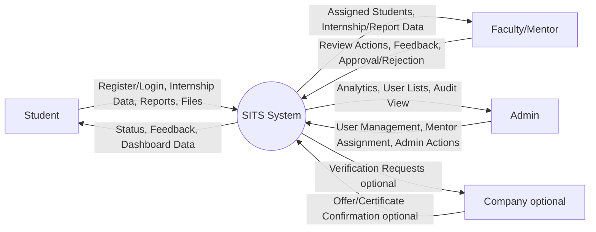
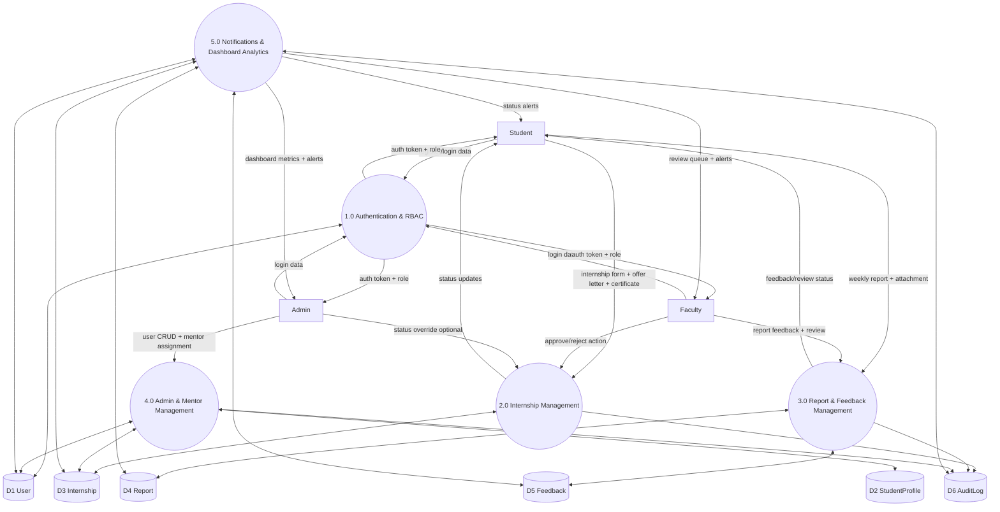
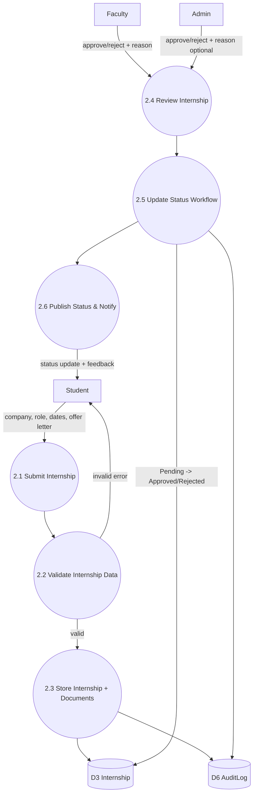
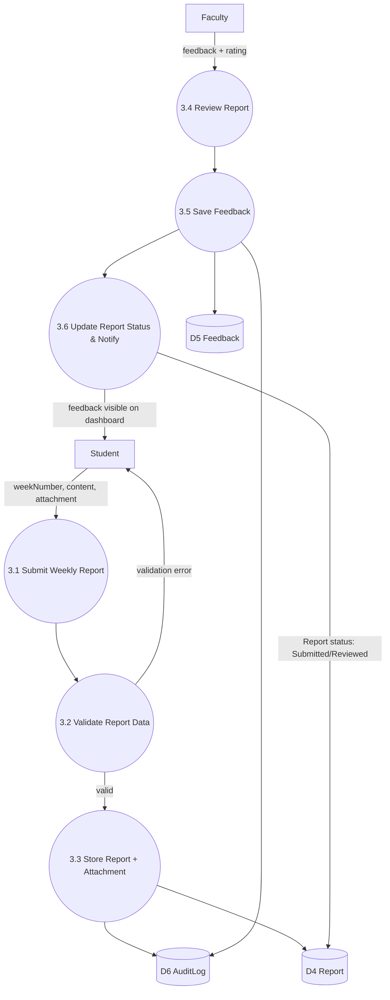

# Data Flow Diagram (DFD) - SITS

This document contains DFD Level 0, Level 1, and Level 2 for the Student Internship Tracking System (SITS).

## DFD Level 0 (Context Diagram)

---

## DFD Level 1 (Major Process Decomposition)

---

## DFD Level 2 (Process 2.0 Internship Management Decomposition)

---

## DFD Level 2 (Process 3.0 Report & Feedback Management Decomposition)

---

## Notes for Viva/Documentation

1. Level 0 shows only external entities and one central process.
2. Level 1 breaks SITS into major business processes.
3. Level 2 gives detailed subprocess data flow for Internship and Report modules.
4. Data stores map directly to MongoDB models:
   - User
   - StudentProfile
   - Internship
   - Report
   - Feedback
   - AuditLog
