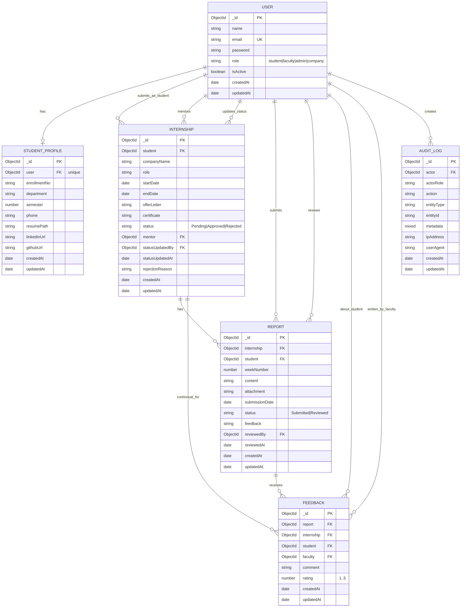

# SITS ER Model

This ER model is derived from the current backend schemas in the models folder.

## Mermaid ER Diagram

## Relationship Notes

- USER to STUDENT_PROFILE is one-to-zero-or-one because only student users have profiles.
- USER to INTERNSHIP includes multiple semantic links:
  - student (owner)
  - mentor (assigned faculty)
  - statusUpdatedBy (faculty/admin actor)
- REPORT belongs to one INTERNSHIP and one student USER.
- FEEDBACK references the reviewed REPORT and keeps denormalized context to INTERNSHIP, student USER, and faculty USER.
- AUDIT_LOG tracks action history and optionally links actor to USER.
