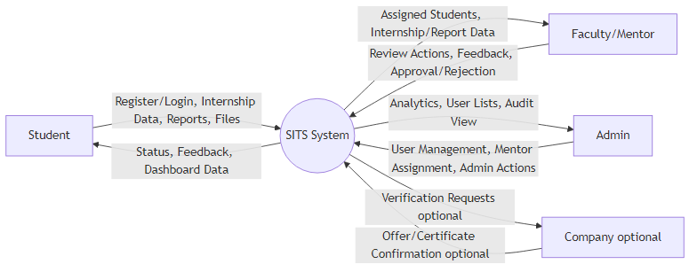
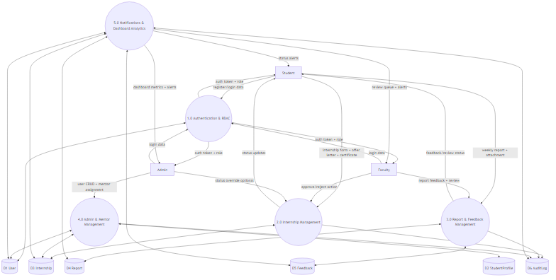
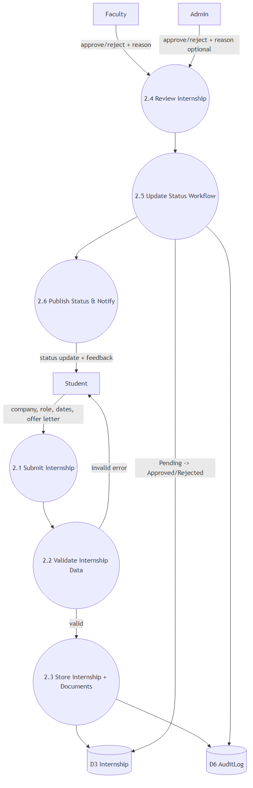
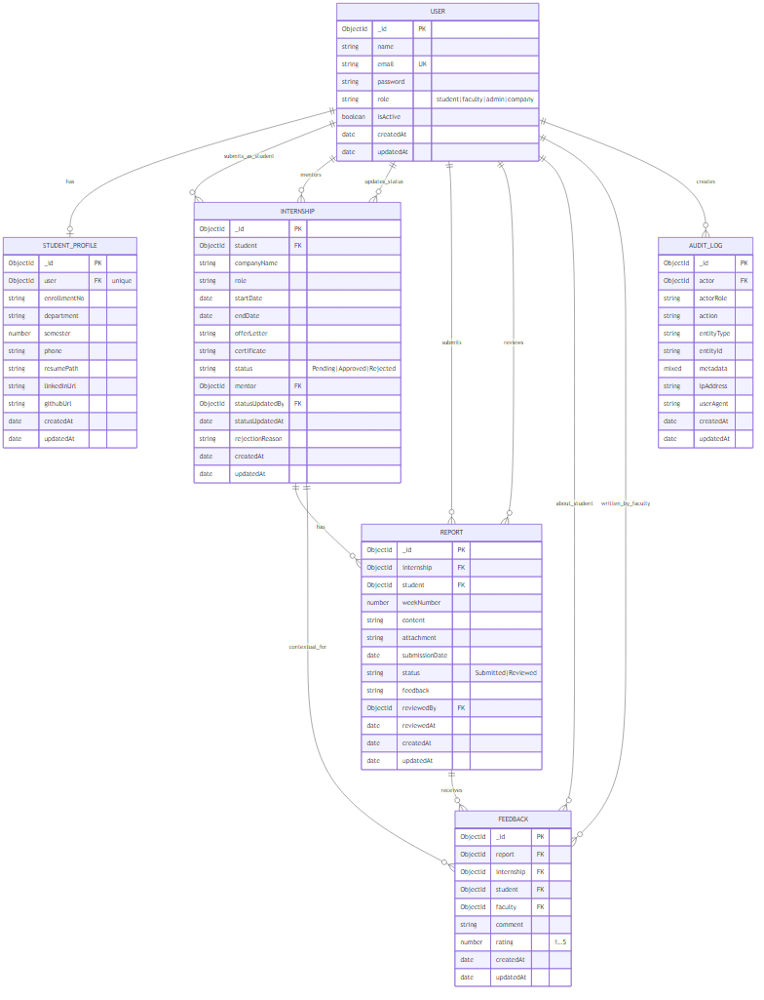

# Student Internship Tracking System (SITS) - Project Report Template

Use this template directly for your final report submission.

## 1. Title Page

Include:
- Project Title: Student Internship Tracking System (SITS)
- Submitted by: Student Name, Enrollment Number, Department
- Guided by: Faculty Name, Designation
- Submitted to: College/University Name
- Degree/Program: B.Tech/BCA/MCA etc.
- Academic Year
- College logo

Suggested title line:
Development of a Student Internship Tracking System Using MERN Stack

## 2. Bonafide Certificate

Include an official certificate statement from department/institute that:
- Confirms the project was carried out by the student
- Mentions project title
- Mentions academic year/semester
- Includes signatures:
  - Project Guide
  - Head of Department
  - External/Internal Examiner (if required)

## 3. Declaration

Include a signed declaration by student that:
- The work is original
- It has not been submitted elsewhere
- Sources/references are acknowledged

Add:
- Student name
- Enrollment number
- Date
- Signature

## 4. Acknowledgment

Thank:
- Principal/Director
- HOD
- Project Guide
- Faculty members
- Friends/peers (optional)
- Family (optional)

Keep this section concise and formal.

## 5. Abstract

Write 1 page covering:
- Problem statement
- Proposed solution
- Tech stack used
- Core modules (student, faculty, admin)
- Main outcomes and benefits

Suggested focus points for this project:
- Internship submission and status tracking
- Mentor approval and report feedback
- Admin analytics and management
- Role-based secure architecture

## 6. Table of Contents

List all sections and subsection page numbers.

Recommended subsections:
- 7.1 Background
- 7.2 Objectives
- 7.3 Scope
- 8.1 Existing Systems
- 8.2 Research Findings
- 9.1 Functional Requirements
- 9.2 Non-Functional Requirements
- 9.3 Feasibility
- 11.1 Collections
- 11.2 Relationships
- 12.1 Setup Scripts
- 12.2 Sample Queries
- 13.1 Test Plan
- 13.2 Test Cases

## 7. Introduction

Include:
- Domain background (internship process in colleges)
- Current manual issues
- Need for automation
- Objectives of SITS

Sample objectives:
- Centralized internship tracking
- Faster approval flow
- Better transparency for students
- Better monitoring for faculty and admin

## 8. Literature Review

Describe:
- Existing internship/project tracking systems
- Similar academic portals
- Key limitations in existing methods
- Why your architecture is better

Add comparison table with columns:
- System
- Technology
- Features
- Limitations
- Improvements in SITS

## 9. System Analysis

Include:
- Problem analysis
- Requirement analysis

Functional requirements:
- User registration/login
- Internship submission
- File uploads
- Report submission and feedback
- Admin user management and mentor assignment

Non-functional requirements:
- Security (JWT, bcrypt)
- Performance
- Usability
- Maintainability
- Data consistency

Also include:
- DFD Level 0, 1, 2 overview
- Module breakdown

You already have DFD files in:
- docs/DFD_0_1_2.md
- docs/DFD_0.png
- docs/DFD_1.png
- docs/DFD_2.png

Insert these figures in the report:

Figure 9.1 - DFD Level 0

Figure 9.2 - DFD Level 1

Figure 9.3 - DFD Level 2

## 10. ER Diagram

Insert and explain ER diagram.

Available files in project:
- docs/ER_MODEL.md
- docs/ER_MODEL.png

Insert this figure in the report:

Figure 10.1 - ER Diagram

Explain each entity:
- User
- StudentProfile
- Internship
- Report
- Feedback
- AuditLog

Explain relationships:
- User to StudentProfile (1:1 for students)
- Student to Internship (1:M)
- Internship to Report (1:M)
- Report to Feedback (1:M)

## 11. Database Schema

Provide collection-wise schema details.

For each collection include:
- Field Name
- Data Type
- Constraint
- Description

Required collections:
- User
- StudentProfile
- Internship
- Report
- Feedback
- AuditLog

Add indexes/constraints section:
- Unique email in User
- Unique user in StudentProfile
- Role/status enums

## 12. SQL Implementation

Note: Project uses MongoDB (NoSQL). In this section, provide equivalent implementation details under two parts:

Part A: MongoDB implementation
- Database creation
- Collection creation
- Insert/update/find examples
- Aggregation for admin stats

Part B: SQL equivalent mapping (for academic requirement)
- Create table style equivalents for User, Internship, Report
- Example SQL queries:
  - Select pending internships
  - Join-like report listing by student
  - Count internships by status

Mention clearly:
This project is implemented in MongoDB; SQL shown is conceptual equivalent for understanding.

## 13. Testing

Include:
- Testing strategy
- Unit/integration/API test cases
- Role-based access test results

Add test matrix with columns:
- Test ID
- Module
- Input
- Expected Output
- Actual Output
- Status (Pass/Fail)

Suggested critical tests:
- Invalid login
- Student cannot access admin routes
- Faculty can approve internship
- File type validation
- Report feedback flow

You can mention existing test command:
- backend npm test

## 14. Screenshots

Add clear screenshots with figure numbers and captions.

Recommended screenshots:
- Login page (light and dark)
- Student dashboard
- Add internship form
- Reports page
- Faculty review dashboard
- Admin dashboard charts
- Notifications panel
- ER diagram
- DFD diagrams

Store and reference in docs/screenshots.

Use this screenshot gallery block (replace/add files as needed):

Figure 14.1 - Login Page (Light)

Figure 14.2 - Login Page (Dark)

Figure 14.3 - Student Dashboard

Figure 14.4 - Add Internship Form

Figure 14.5 - Reports Page

Figure 14.6 - Faculty Dashboard

Figure 14.7 - Admin Dashboard Charts

Figure 14.8 - Notifications Panel

Figure 14.9 - ER Diagram

Figure 14.10 - DFD Level 0

Figure 14.11 - DFD Level 1

Figure 14.12 - DFD Level 2

## 15. Conclusion

Summarize:
- What was implemented
- Objectives achieved
- Practical usefulness for institute
- Learning outcomes from MERN implementation

## 16. Future Scope

Add enhancements such as:
- Email notifications
- Company portal verification workflow
- Advanced analytics and forecasting
- Mobile app
- Cloud deployment and CI/CD
- Document OCR validation

## 17. References

Use proper citation format (IEEE/APA as required by institute).

Include references for:
- MongoDB docs
- Express docs
- React docs
- JWT and bcrypt docs
- Multer docs
- Recharts docs
- Academic papers/articles consulted

Sample reference style:
- React Documentation. Available at: https://react.dev
- MongoDB Documentation. Available at: https://www.mongodb.com/docs

## Final Submission Checklist

Before finalizing report, verify:
- All mandatory sections included
- Figure numbers and table numbers are correct
- Page numbers updated in Table of Contents
- Grammar and formatting checked
- Bonafide, declaration, signatures completed
- Screenshots are clear and readable
- References formatted consistently
